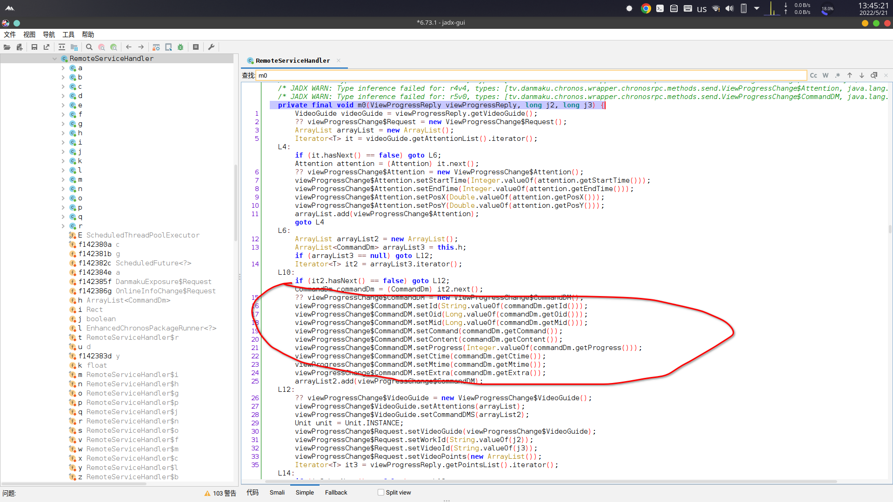

# FuckBilibiliVote
remove vote(投票) attention(一键三连) link(预告) of Bilibili

download: https://github.com/zerorooot/FuckBilibiliVote/releases


Test video link https://www.bilibili.com/video/BV1XY4y1Y7Jm

If you think this app is very helpful to you, please give me a free start, thanks


# How to customize

## Find class name and method name

Decompile the app, search

```
import com.bapis.bilibili.app.view.v1.CommandDm;
```

Find the method where the following code is located

```java
viewProgressChange$CommandDM.setId(String.valueOf(commandDm.getId()));
viewProgressChange$CommandDM.setOid(Long.valueOf(commandDm.getOid()));
viewProgressChange$CommandDM.setMid(Long.valueOf(commandDm.getMid()));
viewProgressChange$CommandDM.setCommand(commandDm.getCommand());
viewProgressChange$CommandDM.setContent(commandDm.getContent());
viewProgressChange$CommandDM.setProgress(Integer.valueOf(commandDm.getProgress()));
viewProgressChange$CommandDM.setCtime(commandDm.getCtime());
viewProgressChange$CommandDM.setMtime(commandDm.getMtime());
viewProgressChange$CommandDM.setExtra(commandDm.getExtra());
arrayList2.add(viewProgressChange$CommandDM);
```

For example, in **version 6.73.1** the method is named **m0**

```java
private final void m0(ViewProgressReply viewProgressReply, long j2, long j3) {}
```



Note: The parameter type of the method must be **ViewProgressReply, long, long**

Record the class name and method name

class name  :`tv.danmaku.chronos.wrapper.chronosrpc.remote.RemoteServiceHandler`

method name : `m0`

## Set class name and method name

Enter the **class name** and **method name** into this app and **save**


**restart** bilibili

enjoy
